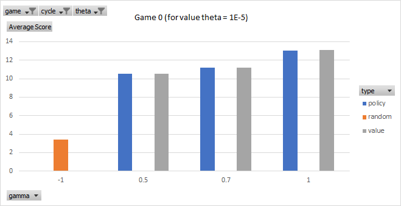
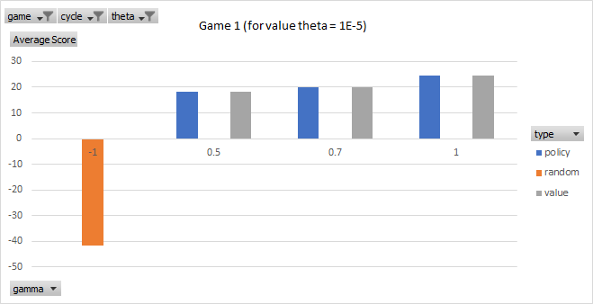
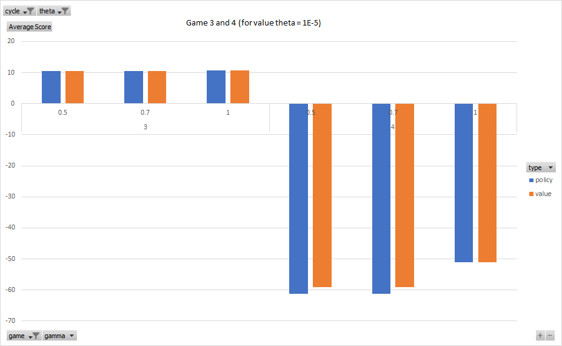
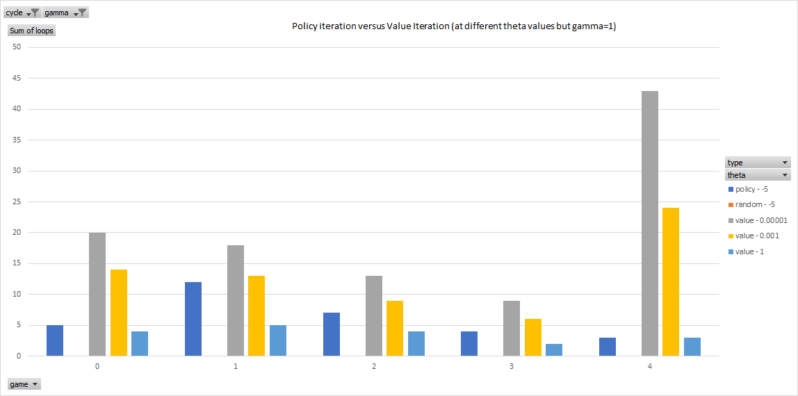
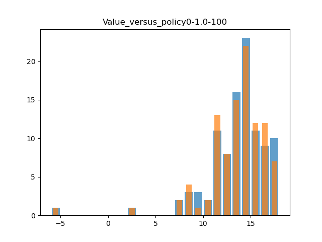
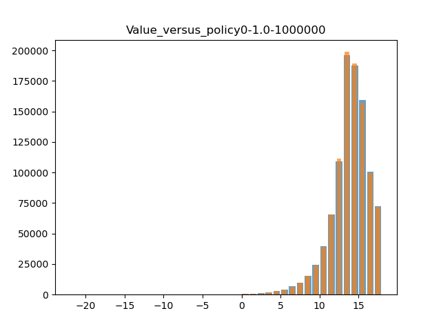
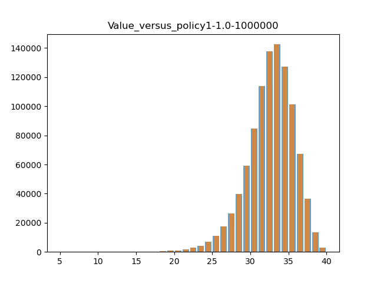

# Summary  

The activity scope was to develop an AI agent for a given dice game for which the game parameters can be varied (number of dice, dice sides, side values, bias, and penalty for re-rolling). The permutation of the dice states are fixed for a given game. This sort of game could be modelled as a Markov decision process since the choice of actions need only be decided based on the current state and not how that state was achieved. There are two common ways of solving this problem - value iteration and policy iteration. Since it was known that this agent would be tested with different game parameters, an agent that converged in fewer iterations was selected - and that is the policy iteration method (Norving and Russel, 2010; Sutton and Barto, 2018; Abbeel, 2012).  While it was proven to be the case that policy iteration can converge sooner, it was also found that under some conditions (games with relatively low states - such as the default 3 dice game) value-iterations produced a higher average score. This phenomenon could not be definitely resolved, but is likely due to the conscious decision of selecting gamma=1 for a game that such a value might not be appropriate. This is since, gamma=1 is not appropriate for a game that can have an infinite iteration (or an inifinite-time-horizon) due to the lack of terminating states. This was allowed since certainty (probability of 1.0) of holding (which is a terminating action) will beat the odds-reward potential (and thus also the value) of rolling again and thus terminating by the terminating action. Since policy iteration causes fewer iterations than that of value iteration this has a similar effect to reducing the far-sightedness of the agent.  

The proposed agent was deemed sufficient because it can produce comparable or equal results over a large quantity (1 million) of game rounds. This is still while being able to tackle more complex game settings without having to pre-determine an appropriate theta setting.


# 1. Introduction

This type of game has a finite set of states, actions and rewards and a suitable problem to solve by Markov Decision Process (MDP) (Sutton and Barto, 2018). This game does not have a terminating state, but rather a terminating action. The terminating action (holding all dice) has a 100% certainty of terminating whereas all non-terminating actions have a 100% certainty of attaining a penalty.  
  
In view of the Bellman equation, the agent can choose to terminate the game when the value of rolling again is unlikely to achieve a higher value state. For the termination action, there are obviously no future states (equivalent to a gamma of 0). In strategic terms, that means that a discount value of 1 leads to an infinite far-sightedness and a discount value of 0 leads to short-sightedness (Wallscheid, 2020). This decision assumes a neutral (0) or negative reward (positive penalty) for rolloing again. If the game were tested with a positive reward for the non-terminating action, then the agent should choose to re-roll forever (it is a 100% certainty of achieving a reward for that action) which is likely what a human player would want to do (so long as time permits it). Since a game that never reaches an end state implies not achieving a goal, an intentional default policy to terminate has been programmed (which for this unique case might not be the optimal solution). This consideration is irrelevant to the scope of this problem since it is known that this test case will not be considered.

In literature there are two popular methods proposed for converging towards a solution for the Bellman equation, that is the value-iteration method and the policy iteration method (Norving and Russel, 2010; Sutton and Barto, 2018; Abbeel, 2012). Value iteration requires an additional parameter to determine at which residual error to stop iteration (hereafter referred to as theta). Theta effectively limits the number of iterations. However, the number of iterations necessary to reach an optimal policy will differ by the complexity of the game (number of dice, dice-values, actions, bias and reward). This would mean that a theta value appropriate for each different game permutation or a way of equating a theta value to the game parameters (or selecting an excessively low value of theta to have a better chance at a reliable setting) is necessary. To avoid this issue, a policy iteration was opted since this will stop the iteration when it seems that the policy has stabilised (even if not truly converged, since a theta value has not been applied). It is known that a policy iteration will converge in fewer iterations (Norving and Russel, 2010). The actual implementation is slightly different from the literature for the sake of optimisation towards execution speed.

# 2. Design Choices and Justification
Several considerations and tests to validate the final choice of agent was made. The agent was tested against several game scenarios described in the appendix. For comparison reasons a random agent was also included for comparisons in some of the following data.  
All tests are conducted with the same seed value of at the start of game configuration listed in the appendix.

## 2.1 Validation of Gamma=1

As can be seen even when testing 2 different games (for definition refer to appendix) results are near identical (game 2):  
  

The same is true even for more a game with more states setups (game 1):  
  

The result also holds true for less attractive or reasonable games (game 3 on the left and game 4 on the right):  
  


## 2.2 Policy Iteration over Value Iteration
However, looking closely at the values for theta = 1E-5 and gamma=1
Game0 - Reviewing the results demonstrated that policy iteration produced a different result For 100 and 10,000 game rounds. This unexpected since, the policy iteration method converged after 5 iterations, and thus it was expected that the value iteration would only produce unecessary furhter iterations. However the different average value implies that some down-stream iteration produced a difference in policy that favours the value iteration agent. However at 1 million game rounds, the policy agent performed better. 
Since the policy iteration based agent performed better at larger samples, it was judged to be sufficiently optimal. 

Table 1: Game 0 (Both at Gamma = 1 and for value iteration Theta = 1E-5)  
  
| rounds | 100   | 10000   | 1000000  |
|--------|-------|---------|----------|
| policy | 13.05 | 13.391  | 13.35079 |
| value  | 13.09 | 13.3923 | 13.34997 |
| Delta  | -0.04 | -0.0013 | 0.000815 |

This result is extremely interesting and this discussed after reviewing the results of more complex game setups (game1 and game2).  

Table 2: Game 1 (Both at Gamma = 1 and for value iteration Theta = 1E-5)
  
| rounds | 100   | 10000   | 1000000 |
|--------|-------|---------|---------|
| policy | 31.64 | 32.2168 | 32.1413 |
| value  | 31.64 | 32.2168 | 32.1413 |
| Delta  | 0     | 0       | 0       |
  
Table 3: Game 2 (Both at Gamma = 1 and for value iteration Theta = 1E-5)  
  
| rounds | 100   | 10000   | 1000000  |
|--------|-------|---------|----------|
| policy | 24.49 | 24.6516 | 24.63817 |
| value  | 24.49 | 24.6516 | 24.63817 |
| Delta  | 0     | 0       | 0        |

These results suggested that policy-iteration is a reasonable choice to ensure scalability without a pre-set parameter theta (which influence construction time on different cases). However in actual fact, it could be that policy-iteration is not the perfect method, since they produce different policies which produce detectable differences on the default game, but not on more complex ones.

Considering that this game does not have terminating states, then this game could have an infinite-time-horizon (or an infinite iteration utility). It is not meant to be allowed to set gamma to 1 for problems that have an infinite-time-horizon. The decision to ignore this, is due to existence of terminating action with a probability of 1.0, that should become more advantegous than rolling again for some states. Thus, with gamma set unintuitively to 1.  
For complex games, the probability to arriving to any of the states each is lower, and so iterative effect on value results in a lower decimal point value. Perhaps due to floating point limitations (or the theta) setting, the values in value iteration "seem" to converge sooner. In case of policy-iteration the iteration is exited earlier, because it assumes that values will only continue to converge (and not oscillate) which is likely to be the case when gamma < 1. For complex games, and thus lower probabilities ratios - policy-iteration and value-iteration are more likely to converge to the same policy due to the floating point limit being the limiting factor (rather than the true mathematical value).


  
The graph shows that for even for game 0, a theta value of 1 would lead to fewer iterations than policy iteration (suggesting that the values had not yet converged enough to achieve a converged policy).
Choosing a lower theta such as 0.001 (which gives a better chance at convergence) results in a higher iteration loop count for all games tested. Searching for the "best" theta value was deemed subjective to the number of game rounds, and dependent on the game complexity, whereas the fixed policy iteration method produced beneficial average scores on all game settings as further described in the next section.  


## 2.3 Histogram Comparison
The final check is more of a sanity check rather than an object validation. That is to look at the histogram of values. A superior agent should have a higher average score that of a random agent, with a distribution skewed to the right (in case of a tail, the tail ought to be on the lower score side).

Looking at the histogram from an equally seeded game0 run over 100 game rounds there is a significant different visible on the historgram. clearly proving that these policies are not identical.  

  

For the same game run for 1 million rounds comparison of value and policy iteration, the difference is less pronounced but noticable for the same game0, there is a detectable difference as shown in the following graph.  The value iteration has a slightly superio skew value of -1.325, whereas the policy iteration has a skew value of -1.336. However, what is interesting is that the score 13, 14 (the mode value) and 15 are more frequent with policy-based iteration, while only the value 16 and 17 are slighly less frequent.  

  
(Narrow/Orange is the policy-iteration, Wide/Blue is the value iteration)

However, just as for the average scores, the value iteration method and policy iterations do not only produce the same results for the other games, they also produce what seems to be near identical histograms as shown here:  

  
(Narrow/Orange is the policy-iteration, Wide/Blue is the value iteration)


# 3. Optimisation Methods  
## 3.1 Common Optimisations for both policy and value iteration
### 3.1.1 Tracking the max value and action
Each iteration tracks the action that has the best value for a given state (to avoid storing the actions and value tables, and searching through them at the ends).

### 3.1.2 Pre-building the in memory the visibility of the game
Executing the following command is slow, and its results will not change during the game since this is an MDP.
```
self.game.get_next_states(action, state)
```
Therefore it was pre-loaded into a dictionary with the following simple for-loop at the same time of initialisation of the value and policy table.
```
    for each_state in possible_states:
        self.policy[(each_state)] = [0, possible_actions[-1]]
        for action in possible_actions:
            derived_states[(action, each_state)] = self.game.get_next_states(action, each_state)
```

## 3.2 Policy iteration
All values are iterated if the policy of any state has not converged (to avoid an additional if-statement for each iteration for each state for action pair).  
  
# 4. Conclusion
The final proposed agent is a balanced agent in the sense that it can produce comparable or equal results over a large game (around 1 million) rounds, when compared to agent utilising value-iteration agent with a very low theta setting. How it will perform in a specific game, will truly depend on the roll of the dice handed.


# Reference List
- Abbeel, P., 2012. Markov Decision Processes and Exact Solution Methods: Value Iteration Policy Iteration Linear Programming [Online]. Available from: https://people.eecs.berkeley.edu/~pabbeel/cs287-fa12/slides/mdps-exact-methods.pdf [Accessed 28 May 2021].
- Norving, P. and Russel, S., 2010. Artificial Intelligence A Modern Approach. Third.
- Sutton, R.S. and Barto, A.G., 2018. Reinforcement Learning: An Introduction Adaptive Computation and Machine Learning. Second.
- Wallscheid, O., 2020. Lecture 01: Introduction to Reinforcement Learning - YouTube [Online]. Available from: https://www.youtube.com/watch?v=9LLzaIJuu-E&t=2188s [Accessed 31 May 2021].


# Appendix
## Game Modes
Game_0: DiceGame()  
Game_1: DiceGame(dice=5, sides=8)  
Game_2: DiceGame(dice=6, sides=5)  
Game_3: DiceGame(dice=3, sides=6, penalty=5)  
Game_4: DiceGame(dice=2, sides=4, values=[-50, -25, -2, 5], bias = [0.1, 0.1, 0.1, 0.7])  

## Tabulated Results
Negative values indicate unusued parameter for the respective test case.  

| type   | game | gamma | theta    | round   | min  | max | average  | time     | loops | skew     |
|--------|------|-------|----------|---------|------|-----|----------|----------|-------|----------|
| random | 0    | -1    | -5       | 100     | -24  | 17  | 3.4      | 0        | 0     | -0.84027 |
| random | 0    | -1    | -5       | 10000   | -62  | 18  | 3.3707   | 0        | 0     | -1.54541 |
| random | 0    | -1    | -5       | 1000000 | -91  | 18  | 3.499464 | 0        | 0     | -1.53687 |
| random | 1    | -1    | -5       | 100     | -177 | 27  | -9.04    | 0        | 0     | -2.44948 |
| random | 1    | -1    | -5       | 10000   | -317 | 38  | -9.0559  | 0        | 0     | -1.98928 |
| random | 1    | -1    | -5       | 1000000 | -456 | 40  | -8.47514 | 0        | 0     | -1.87914 |
| random | 2    | -1    | -5       | 100     | -269 | 25  | -41.5    | 0        | 0     | -1.70112 |
| random | 2    | -1    | -5       | 10000   | -685 | 28  | -44.7618 | 0        | 0     | -1.93877 |
| value  | 0    | 0.5   | 1        | 100     | 5    | 18  | 10.56    | 0.140625 | 2     | 0.365957 |
| value  | 0    | 0.7   | 1        | 100     | 7    | 18  | 11.16    | 0.125    | 2     | 0.715788 |
| value  | 0    | 1     | 1        | 100     | -6   | 18  | 13.05    | 0.140625 | 4     | -2.52702 |
| value  | 0    | 0.5   | 0.001    | 100     | 5    | 18  | 10.56    | 0.171875 | 4     | 0.365957 |
| value  | 0    | 0.7   | 0.001    | 100     | 8    | 18  | 11.22    | 0.1875   | 6     | 0.750233 |
| value  | 0    | 1     | 0.001    | 100     | -6   | 18  | 13.09    | 0.21875  | 14    | -2.42467 |
| value  | 0    | 0.5   | 1.00E-05 | 100     | 5    | 18  | 10.56    | 0.203125 | 6     | 0.365957 |
| value  | 0    | 0.7   | 1.00E-05 | 100     | 8    | 18  | 11.22    | 0.234375 | 8     | 0.750233 |
| value  | 0    | 1     | 1.00E-05 | 100     | -6   | 18  | 13.09    | 0.28125  | 20    | -2.42467 |
| value  | 0    | 0.5   | 1        | 10000   | 4    | 18  | 10.7009  | 0.125    | 2     | 0.204927 |
| value  | 0    | 0.7   | 1        | 10000   | 4    | 18  | 11.2488  | 0.125    | 2     | 0.348124 |
| value  | 0    | 1     | 1        | 10000   | -6   | 18  | 13.391   | 0.140625 | 4     | -1.27492 |
| value  | 0    | 0.5   | 0.001    | 10000   | 4    | 18  | 10.7009  | 0.171875 | 4     | 0.204927 |
| value  | 0    | 0.7   | 0.001    | 10000   | 4    | 18  | 11.2366  | 0.1875   | 6     | 0.368662 |
| value  | 0    | 1     | 0.001    | 10000   | -6   | 18  | 13.3923  | 0.25     | 14    | -1.22895 |
| value  | 0    | 0.5   | 1.00E-05 | 10000   | 4    | 18  | 10.7009  | 0.1875   | 6     | 0.204927 |
| value  | 0    | 0.7   | 1.00E-05 | 10000   | 4    | 18  | 11.2366  | 0.21875  | 8     | 0.368662 |
| value  | 0    | 1     | 1.00E-05 | 10000   | -6   | 18  | 13.3923  | 0.28125  | 20    | -1.22895 |
| value  | 0    | 0.5   | 1        | 1000000 | 3    | 18  | 10.72961 | 0.125    | 2     | 0.191697 |
| value  | 0    | 0.7   | 1        | 1000000 | 2    | 18  | 11.24602 | 0.109375 | 2     | 0.358952 |
| value  | 0    | 1     | 1        | 1000000 | -22  | 18  | 13.35079 | 0.140625 | 4     | -1.32545 |
| value  | 0    | 0.5   | 0.001    | 1000000 | 3    | 18  | 10.72961 | 0.171875 | 4     | 0.191697 |
| value  | 0    | 0.7   | 0.001    | 1000000 | 3    | 18  | 11.24974 | 0.1875   | 6     | 0.379647 |
| value  | 0    | 1     | 0.001    | 1000000 | -22  | 18  | 13.34997 | 0.234375 | 14    | -1.33637 |
| value  | 0    | 0.5   | 1.00E-05 | 1000000 | 3    | 18  | 10.72961 | 0.203125 | 6     | 0.191697 |
| value  | 0    | 0.7   | 1.00E-05 | 1000000 | 3    | 18  | 11.24974 | 0.234375 | 8     | 0.379647 |
| value  | 0    | 1     | 1.00E-05 | 1000000 | -22  | 18  | 13.34997 | 0.28125  | 20    | -1.33637 |
| value  | 1    | 0.5   | 1        | 100     | 11   | 35  | 22.8     | 39.125   | 3     | 0.067788 |
| value  | 1    | 0.7   | 1        | 100     | 16   | 35  | 23.54    | 36.98438 | 3     | 0.495857 |
| value  | 1    | 1     | 1        | 100     | 25   | 38  | 31.79    | 34.79688 | 5     | -0.05926 |
| value  | 1    | 0.5   | 0.001    | 100     | 11   | 35  | 22.8     | 46.21875 | 4     | 0.067788 |
| value  | 1    | 0.7   | 0.001    | 100     | 16   | 35  | 23.54    | 49.73438 | 5     | 0.495857 |
| value  | 1    | 1     | 0.001    | 100     | 25   | 38  | 31.64    | 53.96875 | 13    | -0.08309 |
| value  | 1    | 0.5   | 1.00E-05 | 100     | 11   | 35  | 22.8     | 53.0625  | 5     | 0.067788 |
| value  | 1    | 0.7   | 1.00E-05 | 100     | 16   | 35  | 23.54    | 62.65625 | 7     | 0.495857 |
| value  | 1    | 1     | 1.00E-05 | 100     | 25   | 38  | 31.64    | 65.9375  | 18    | -0.08309 |
| value  | 1    | 0.5   | 1        | 10000   | 11   | 40  | 22.9882  | 39.25    | 3     | 0.166845 |
| value  | 1    | 0.7   | 1        | 10000   | 14   | 40  | 24.5651  | 37       | 3     | 0.359585 |
| value  | 1    | 1     | 1        | 10000   | 14   | 40  | 32.215   | 34.90625 | 5     | -0.73497 |
| value  | 1    | 0.5   | 0.001    | 10000   | 11   | 40  | 22.9882  | 46.125   | 4     | 0.166845 |
| value  | 1    | 0.7   | 0.001    | 10000   | 14   | 40  | 24.5651  | 49.73438 | 5     | 0.359585 |
| value  | 1    | 1     | 0.001    | 10000   | 16   | 40  | 32.2168  | 54.01563 | 13    | -0.71088 |
| value  | 1    | 0.5   | 1.00E-05 | 10000   | 11   | 40  | 22.9882  | 53.17188 | 5     | 0.166845 |
| value  | 1    | 0.7   | 1.00E-05 | 10000   | 14   | 40  | 24.5651  | 62.73438 | 7     | 0.359585 |
| value  | 1    | 1     | 1.00E-05 | 10000   | 16   | 40  | 32.2168  | 66.04688 | 18    | -0.71088 |
| value  | 1    | 0.5   | 1        | 1000000 | 10   | 40  | 22.94664 | 39.09375 | 3     | 0.148052 |
| value  | 1    | 0.7   | 1        | 1000000 | 12   | 40  | 24.55139 | 37.28125 | 3     | 0.366622 |
| value  | 1    | 1     | 1        | 1000000 | 6    | 40  | 32.12709 | 34.76563 | 5     | -0.70038 |
| value  | 1    | 0.5   | 0.001    | 1000000 | 10   | 40  | 22.94664 | 46.51563 | 4     | 0.148052 |
| value  | 1    | 0.7   | 0.001    | 1000000 | 12   | 40  | 24.55139 | 49.875   | 5     | 0.366622 |
| value  | 1    | 1     | 0.001    | 1000000 | 5    | 40  | 32.1413  | 54.10938 | 13    | -0.77069 |
| value  | 1    | 0.5   | 1.00E-05 | 1000000 | 10   | 40  | 22.94664 | 53.51563 | 5     | 0.148052 |
| value  | 1    | 0.7   | 1.00E-05 | 1000000 | 12   | 40  | 24.55139 | 63.51563 | 7     | 0.366622 |
| value  | 1    | 1     | 1.00E-05 | 1000000 | 5    | 40  | 32.1413  | 66.375   | 18    | -0.77069 |
| value  | 2    | 0.5   | 1        | 100     | 9    | 28  | 18.24    | 7.515625 | 2     | 0.16692  |
| value  | 2    | 0.7   | 1        | 100     | 12   | 29  | 19.93    | 7.265625 | 2     | 0.149143 |
| value  | 2    | 1     | 1        | 100     | 19   | 28  | 24.46    | 7.515625 | 4     | -0.44061 |
| value  | 2    | 0.5   | 0.001    | 100     | 9    | 28  | 18.24    | 8.96875  | 3     | 0.16692  |
| value  | 2    | 0.7   | 0.001    | 100     | 12   | 29  | 19.93    | 9.796875 | 4     | 0.149143 |
| value  | 2    | 1     | 0.001    | 100     | 19   | 29  | 24.49    | 10.42188 | 9     | -0.26594 |
| value  | 2    | 0.5   | 1.00E-05 | 100     | 9    | 28  | 18.24    | 10.35938 | 4     | 0.16692  |
| value  | 2    | 0.7   | 1.00E-05 | 100     | 12   | 29  | 19.93    | 12.29688 | 6     | 0.149143 |
| value  | 2    | 1     | 1.00E-05 | 100     | 19   | 29  | 24.49    | 12.6875  | 13    | -0.26594 |
| value  | 2    | 0.5   | 1        | 10000   | 9    | 30  | 18.425   | 7.484375 | 2     | 0.03768  |
| value  | 2    | 0.7   | 1        | 10000   | 11   | 30  | 20.0622  | 7.28125  | 2     | 0.100954 |
| value  | 2    | 1     | 1        | 10000   | 13   | 30  | 24.6583  | 7.640625 | 4     | -0.64903 |
| value  | 2    | 0.5   | 0.001    | 10000   | 9    | 30  | 18.425   | 8.984375 | 3     | 0.03768  |
| value  | 2    | 0.7   | 0.001    | 10000   | 11   | 30  | 20.0622  | 9.859375 | 4     | 0.100954 |
| value  | 2    | 1     | 0.001    | 10000   | 12   | 30  | 24.6516  | 10.25    | 9     | -0.68829 |
| value  | 2    | 0.5   | 1.00E-05 | 10000   | 9    | 30  | 18.425   | 10.34375 | 4     | 0.03768  |
| value  | 2    | 0.7   | 1.00E-05 | 10000   | 11   | 30  | 20.0622  | 12.34375 | 6     | 0.100954 |
| value  | 2    | 1     | 1.00E-05 | 10000   | 12   | 30  | 24.6516  | 12.40625 | 13    | -0.68829 |
| value  | 2    | 0.5   | 1        | 1000000 | 8    | 30  | 18.39373 | 7.515625 | 2     | 0.044942 |
| value  | 2    | 0.7   | 1        | 1000000 | 10   | 30  | 20.00285 | 7.328125 | 2     | 0.123627 |
| value  | 2    | 1     | 1        | 1000000 | 6    | 30  | 24.6373  | 7.640625 | 4     | -0.64844 |
| value  | 2    | 0.5   | 0.001    | 1000000 | 8    | 30  | 18.39373 | 9.046875 | 3     | 0.044942 |
| value  | 2    | 0.7   | 0.001    | 1000000 | 10   | 30  | 20.00285 | 9.84375  | 4     | 0.123627 |
| value  | 2    | 1     | 0.001    | 1000000 | 6    | 30  | 24.63817 | 10.26563 | 9     | -0.72782 |
| value  | 2    | 0.5   | 1.00E-05 | 1000000 | 8    | 30  | 18.39373 | 10.53125 | 4     | 0.044942 |
| value  | 2    | 0.7   | 1.00E-05 | 1000000 | 10   | 30  | 20.00285 | 12.35938 | 6     | 0.123627 |
| value  | 2    | 1     | 1.00E-05 | 1000000 | 6    | 30  | 24.63817 | 12.46875 | 13    | -0.72782 |
| value  | 3    | 0.5   | 1        | 100     | 3    | 18  | 10.54    | 0.125    | 2     | -0.10414 |
| value  | 3    | 0.7   | 1        | 100     | 3    | 18  | 10.54    | 0.109375 | 2     | -0.10414 |
| value  | 3    | 1     | 1        | 100     | -2   | 18  | 10.39    | 0.109375 | 2     | -0.57079 |
| value  | 3    | 0.5   | 0.001    | 100     | 3    | 18  | 10.54    | 0.15625  | 2     | -0.10414 |
| value  | 3    | 0.7   | 0.001    | 100     | 3    | 18  | 10.54    | 0.140625 | 2     | -0.10414 |
| value  | 3    | 1     | 0.001    | 100     | -2   | 18  | 10.72    | 0.203125 | 6     | -0.53026 |
| value  | 3    | 0.5   | 1.00E-05 | 100     | 3    | 18  | 10.54    | 0.109375 | 2     | -0.10414 |
| value  | 3    | 0.7   | 1.00E-05 | 100     | 3    | 18  | 10.54    | 0.125    | 2     | -0.10414 |
| value  | 3    | 1     | 1.00E-05 | 100     | -2   | 18  | 10.72    | 0.234375 | 9     | -0.53026 |
| value  | 3    | 0.5   | 1        | 10000   | 3    | 18  | 10.4868  | 0.125    | 2     | -0.00097 |
| value  | 3    | 0.7   | 1        | 10000   | 3    | 18  | 10.4868  | 0.140625 | 2     | -0.00097 |
| value  | 3    | 1     | 1        | 10000   | -16  | 18  | 10.5852  | 0.125    | 2     | -0.13712 |
| value  | 3    | 0.5   | 0.001    | 10000   | 3    | 18  | 10.4868  | 0.125    | 2     | -0.00097 |
| value  | 3    | 0.7   | 0.001    | 10000   | 3    | 18  | 10.4868  | 0.125    | 2     | -0.00097 |
| value  | 3    | 1     | 0.001    | 10000   | -15  | 18  | 10.6196  | 0.171875 | 6     | -0.36068 |
| value  | 3    | 0.5   | 1.00E-05 | 10000   | 3    | 18  | 10.4868  | 0.125    | 2     | -0.00097 |
| value  | 3    | 0.7   | 1.00E-05 | 10000   | 3    | 18  | 10.4868  | 0.125    | 2     | -0.00097 |
| value  | 3    | 1     | 1.00E-05 | 10000   | -15  | 18  | 10.6196  | 0.25     | 9     | -0.36068 |
| value  | 3    | 0.5   | 1        | 1000000 | 3    | 18  | 10.5021  | 0.125    | 2     | -0.00098 |
| value  | 3    | 0.7   | 1        | 1000000 | 3    | 18  | 10.5021  | 0.125    | 2     | -0.00098 |
| value  | 3    | 1     | 1        | 1000000 | -24  | 18  | 10.62865 | 0.140625 | 2     | -0.15267 |
| value  | 3    | 0.5   | 0.001    | 1000000 | 3    | 18  | 10.5021  | 0.125    | 2     | -0.00098 |
| value  | 3    | 0.7   | 0.001    | 1000000 | 3    | 18  | 10.5021  | 0.125    | 2     | -0.00098 |
| value  | 3    | 1     | 0.001    | 1000000 | -24  | 18  | 10.62913 | 0.203125 | 6     | -0.34713 |
| value  | 3    | 0.5   | 1.00E-05 | 1000000 | 3    | 18  | 10.5021  | 0.125    | 2     | -0.00098 |
| value  | 3    | 0.7   | 1.00E-05 | 1000000 | 3    | 18  | 10.5021  | 0.125    | 2     | -0.00098 |
| value  | 3    | 1     | 1.00E-05 | 1000000 | -24  | 18  | 10.62913 | 0.25     | 9     | -0.34713 |
| value  | 4    | 0.5   | 1        | 100     | -100 | 10  | -56.71   | 0        | 2     | 0.240321 |
| value  | 4    | 0.7   | 1        | 100     | -100 | 10  | -56.71   | 0        | 2     | 0.240321 |
| value  | 4    | 1     | 1        | 100     | -100 | 10  | -54.68   | 0.015625 | 3     | 0.183218 |
| value  | 4    | 0.5   | 0.001    | 100     | -100 | 10  | -56.71   | 0.015625 | 4     | 0.240321 |
| value  | 4    | 0.7   | 0.001    | 100     | -100 | 10  | -56.71   | 0.015625 | 6     | 0.240321 |
| value  | 4    | 1     | 0.001    | 100     | -100 | 10  | -54.68   | 0.015625 | 24    | 0.183218 |
| value  | 4    | 0.5   | 1.00E-05 | 100     | -100 | 10  | -56.71   | 0        | 6     | 0.240321 |
| value  | 4    | 0.7   | 1.00E-05 | 100     | -100 | 10  | -56.71   | 0.015625 | 8     | 0.240321 |
| value  | 4    | 1     | 1.00E-05 | 100     | -100 | 10  | -54.68   | 0.015625 | 43    | 0.183218 |
| value  | 4    | 0.5   | 1        | 10000   | -100 | 10  | -58.9921 | 0.015625 | 2     | 0.300381 |
| value  | 4    | 0.7   | 1        | 10000   | -100 | 10  | -58.9921 | 0.015625 | 2     | 0.300381 |
| value  | 4    | 1     | 1        | 10000   | -100 | 10  | -51.1715 | 0        | 3     | 0.032217 |
| value  | 4    | 0.5   | 0.001    | 10000   | -100 | 10  | -58.9921 | 0.015625 | 4     | 0.300381 |
| value  | 4    | 0.7   | 0.001    | 10000   | -100 | 10  | -58.9921 | 0        | 6     | 0.300381 |
| value  | 4    | 1     | 0.001    | 10000   | -100 | 10  | -51.1715 | 0.015625 | 24    | 0.032217 |
| value  | 4    | 0.5   | 1.00E-05 | 10000   | -100 | 10  | -58.9921 | 0        | 6     | 0.300381 |
| value  | 4    | 0.7   | 1.00E-05 | 10000   | -100 | 10  | -58.9921 | 0.015625 | 8     | 0.300381 |
| value  | 4    | 1     | 1.00E-05 | 10000   | -100 | 10  | -51.1715 | 0.015625 | 43    | 0.032217 |
| value  | 4    | 0.5   | 1        | 1000000 | -100 | 10  | -58.9876 | 0        | 2     | 0.301701 |
| value  | 4    | 0.7   | 1        | 1000000 | -100 | 10  | -58.9876 | 0        | 2     | 0.301701 |
| value  | 4    | 1     | 1        | 1000000 | -100 | 10  | -51.076  | 0        | 3     | 0.025819 |
| value  | 4    | 0.5   | 0.001    | 1000000 | -100 | 10  | -58.9876 | 0        | 4     | 0.301701 |
| value  | 4    | 0.7   | 0.001    | 1000000 | -100 | 10  | -58.9876 | 0        | 6     | 0.301701 |
| value  | 4    | 1     | 0.001    | 1000000 | -100 | 10  | -51.076  | 0.015625 | 24    | 0.025819 |
| value  | 4    | 0.5   | 1.00E-05 | 1000000 | -100 | 10  | -58.9876 | 0.015625 | 6     | 0.301701 |
| value  | 4    | 0.7   | 1.00E-05 | 1000000 | -100 | 10  | -58.9876 | 0.015625 | 8     | 0.301701 |
| value  | 4    | 1     | 1.00E-05 | 1000000 | -100 | 10  | -51.076  | 0.015625 | 43    | 0.025819 |
| policy | 0    | 0.5   | -5       | 100     | 5    | 18  | 10.56    | 0.15625  | 3     | 0.365957 |
| policy | 0    | 0.7   | -5       | 100     | 8    | 18  | 11.22    | 0.15625  | 4     | 0.750233 |
| policy | 0    | 1     | -5       | 100     | -6   | 18  | 13.05    | 0.15625  | 5     | -2.52702 |
| policy | 0    | 0.5   | -5       | 10000   | 4    | 18  | 10.7009  | 0.15625  | 3     | 0.204927 |
| policy | 0    | 0.7   | -5       | 10000   | 4    | 18  | 11.2366  | 0.15625  | 4     | 0.368662 |
| policy | 0    | 1     | -5       | 10000   | -6   | 18  | 13.391   | 0.15625  | 5     | -1.27492 |
| policy | 0    | 0.5   | -5       | 1000000 | 3    | 18  | 10.72961 | 0.140625 | 3     | 0.191697 |
| policy | 0    | 0.7   | -5       | 1000000 | 3    | 18  | 11.24974 | 0.171875 | 4     | 0.379647 |
| policy | 0    | 1     | -5       | 1000000 | -22  | 18  | 13.35079 | 0.140625 | 5     | -1.32545 |
| policy | 1    | 0.5   | -5       | 100     | 11   | 35  | 22.8     | 38.85938 | 3     | 0.067788 |
| policy | 1    | 0.7   | -5       | 100     | 16   | 35  | 23.54    | 43.59375 | 4     | 0.495857 |
| policy | 1    | 1     | -5       | 100     | 25   | 38  | 31.64    | 51.59375 | 12    | -0.08309 |
| policy | 1    | 0.5   | -5       | 10000   | 11   | 40  | 22.9882  | 38.73438 | 3     | 0.166845 |
| policy | 1    | 0.7   | -5       | 10000   | 14   | 40  | 24.5651  | 43.84375 | 4     | 0.359585 |
| policy | 1    | 1     | -5       | 10000   | 16   | 40  | 32.2168  | 51.76563 | 12    | -0.71088 |
| policy | 1    | 0.5   | -5       | 1000000 | 10   | 40  | 22.94664 | 38.89063 | 3     | 0.148052 |
| policy | 1    | 0.7   | -5       | 1000000 | 12   | 40  | 24.55139 | 43.82813 | 4     | 0.366622 |
| policy | 1    | 1     | -5       | 1000000 | 5    | 40  | 32.1413  | 52.65625 | 12    | -0.77069 |
| policy | 2    | 0.5   | -5       | 100     | 9    | 28  | 18.24    | 9.046875 | 3     | 0.16692  |
| policy | 2    | 0.7   | -5       | 100     | 12   | 29  | 19.93    | 8.609375 | 3     | 0.149143 |
| policy | 2    | 1     | -5       | 100     | 19   | 29  | 24.49    | 9.28125  | 7     | -0.26594 |
| policy | 2    | 0.5   | -5       | 10000   | 9    | 30  | 18.425   | 8.984375 | 3     | 0.03768  |
| policy | 2    | 0.7   | -5       | 10000   | 11   | 30  | 20.0622  | 8.65625  | 3     | 0.100954 |
| policy | 2    | 1     | -5       | 10000   | 12   | 30  | 24.6516  | 9.28125  | 7     | -0.68829 |
| policy | 2    | 0.5   | -5       | 1000000 | 8    | 30  | 18.39373 | 8.96875  | 3     | 0.044942 |
| policy | 2    | 0.7   | -5       | 1000000 | 10   | 30  | 20.00285 | 8.609375 | 3     | 0.123627 |
| policy | 2    | 1     | -5       | 1000000 | 6    | 30  | 24.63817 | 9.1875   | 7     | -0.72782 |
| policy | 3    | 0.5   | -5       | 100     | 3    | 18  | 10.54    | 0.109375 | 1     | -0.10414 |
| policy | 3    | 0.7   | -5       | 100     | 3    | 18  | 10.54    | 0.109375 | 1     | -0.10414 |
| policy | 3    | 1     | -5       | 100     | -2   | 18  | 10.72    | 0.15625  | 4     | -0.53026 |
| policy | 3    | 0.5   | -5       | 10000   | 3    | 18  | 10.4868  | 0.109375 | 1     | -0.00097 |
| policy | 3    | 0.7   | -5       | 10000   | 3    | 18  | 10.4868  | 0.140625 | 1     | -0.00097 |
| policy | 3    | 1     | -5       | 10000   | -15  | 18  | 10.6196  | 0.140625 | 4     | -0.36068 |
| policy | 3    | 0.5   | -5       | 1000000 | 3    | 18  | 10.5021  | 0.09375  | 1     | -0.00098 |
| policy | 3    | 0.7   | -5       | 1000000 | 3    | 18  | 10.5021  | 0.109375 | 1     | -0.00098 |
| policy | 3    | 1     | -5       | 1000000 | -24  | 18  | 10.62913 | 0.15625  | 4     | -0.34713 |
| policy | 4    | 0.5   | -5       | 100     | -100 | 10  | -58.89   | 0.015625 | 1     | 0.276725 |
| policy | 4    | 0.7   | -5       | 100     | -100 | 10  | -58.89   | 0        | 1     | 0.276725 |
| policy | 4    | 1     | -5       | 100     | -100 | 10  | -54.68   | 0        | 3     | 0.183218 |
| policy | 4    | 0.5   | -5       | 10000   | -100 | 10  | -61.2461 | 0        | 1     | 0.358306 |
| policy | 4    | 0.7   | -5       | 10000   | -100 | 10  | -61.2461 | 0        | 1     | 0.358306 |
| policy | 4    | 1     | -5       | 10000   | -100 | 10  | -51.1715 | 0        | 3     | 0.032217 |
| policy | 4    | 0.5   | -5       | 1000000 | -100 | 10  | -61.1445 | 0.015625 | 1     | 0.354851 |
| policy | 4    | 0.7   | -5       | 1000000 | -100 | 10  | -61.1445 | 0        | 1     | 0.354851 |
| policy | 4    | 1     | -5       | 1000000 | -100 | 10  | -51.076  | 0        | 3     | 0.025819 |
